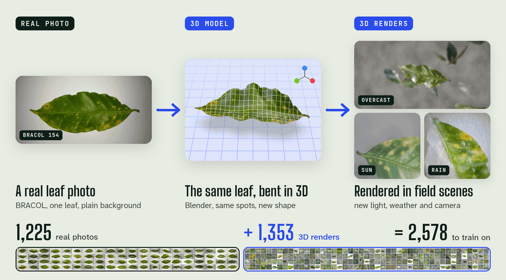
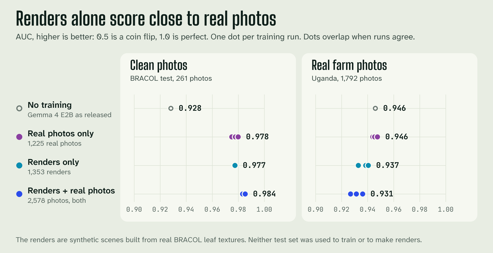
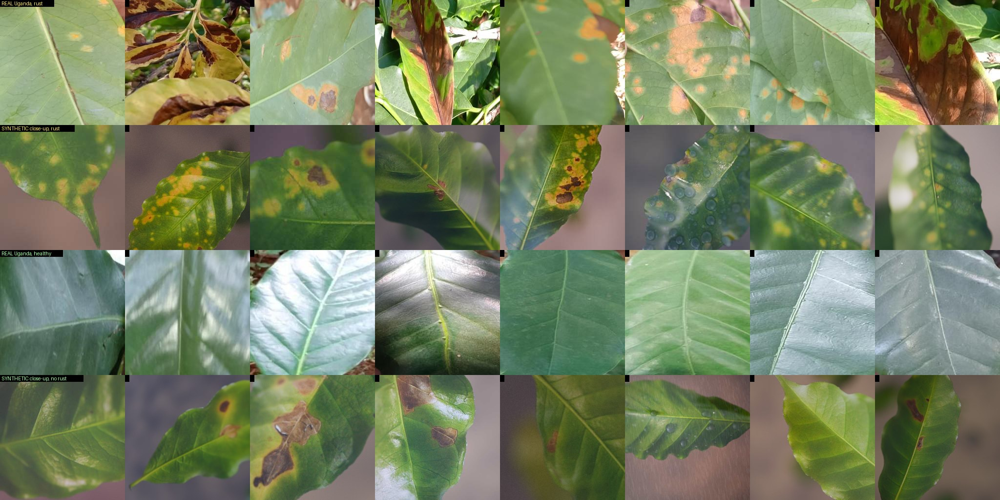
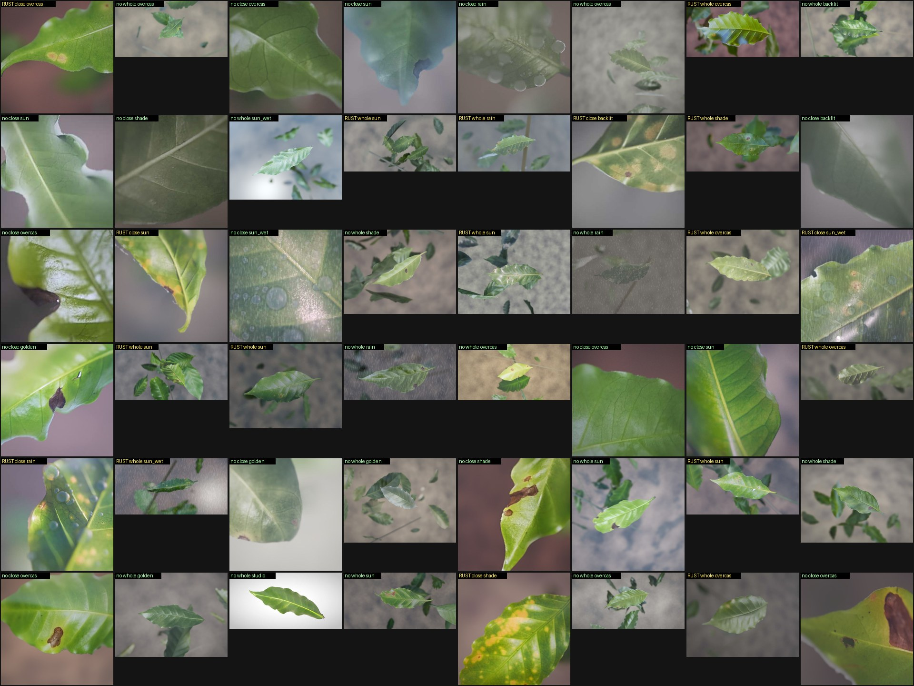
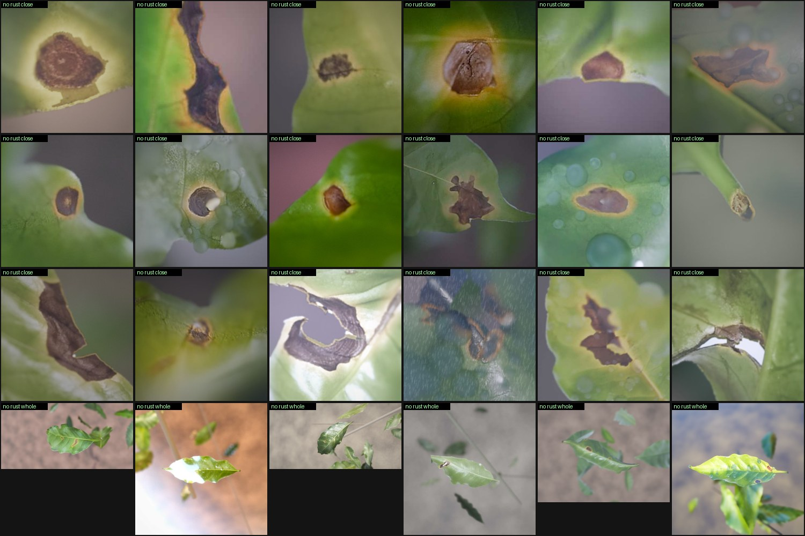
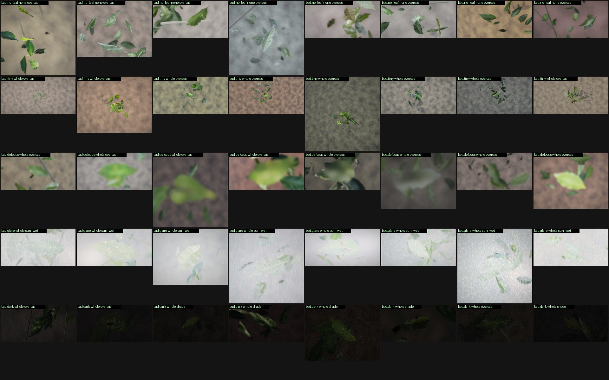

<h1 align="center">ShhS</h1>

<p align="center">
  <b>Synthetic 3D leaves that grow the training set of a small AI.</b><br>
  We turn real coffee leaf photos into 3D scenes.<br>
  The AI answers one question about a phone photo: does this leaf have rust?
</p>

<p align="center">
  <picture>
    <source media="(prefers-reduced-motion: reduce)" srcset="docs/readme/hero-still.png">
    
  </picture>
</p>

<p align="center">
  <a href="#the-idea">The idea</a> &nbsp;·&nbsp;
  <a href="#what-we-found">What we found</a> &nbsp;·&nbsp;
  <a href="#results">Results</a> &nbsp;·&nbsp;
  <a href="#data">Data</a> &nbsp;·&nbsp;
  <a href="#run-it">Run it</a> &nbsp;·&nbsp;
  <a href="#what-this-study-cant-tell-you">Limits</a>
</p>

<p align="center">
  <sub>Hack-Nation x World Bank "Small AI for development", challenge 04b (agriculture). Team ShhS.<br>
  Gemma 4 E2B · LoRA · Blender 5.2 · BRACOL</sub>
</p>

## The idea

Public leaf photos show one leaf on a plain background. Farm photos don't look like that. So we cut each leaf out of its photo, bend it into a 3D model in Blender, and render it in field scenes with new light, weather and cameras. Each render keeps the label of its real leaf.

We add the renders to the training photos of Gemma 4 E2B, a small vision-language model. We fine-tune it with LoRA to say yes or no: does the leaf have rust? Then we test it on real farm photos it never saw.

The renders are synthetic scenes built from real BRACOL leaf textures. They aren't free of real data.

## What we found

<p align="center">
  
</p>

| Question | Short answer |
| --- | --- |
| Can renders replace real photos? | Almost. A model trained on renders alone scores AUC 0.977 on clean BRACOL photos. One trained on real photos scores 0.978. On 1,792 real Uganda phone photos the scores are 0.937 and 0.946. |
| Does adding renders to real photos help? | Not on farm photos. On Uganda, AUC falls from 0.946 to 0.931, and the model raises more false alarms on phoma leaves. On clean photos AUC rises by 0.002 to 0.006, which we don't call a win. |
| Can a second render recipe fix that? | It ties real photos and doesn't beat them. Set v3 paints a yellow or orange rim around the lesions on other-disease renders. The mix that came closest scores AUC 0.940 on Uganda, against 0.946 for real photos alone. We made v3 after we looked at the Uganda mistakes, so that score is not a clean test. |
| What else helped? | A cut-off set on local photos. It lifts the untrained model's accuracy on Uganda by 5 points, and about 100 local photos are almost as good as 1,492. Set this way, the "not sure" rule works on farm photos. |

AUC is how well the model ranks rust leaves above the others. 0.5 is a coin flip and 1.0 is perfect.

## Where things stand

This repo holds a finished study and a talk. It doesn't hold a phone app yet.

What exists:

- BRACOL, a public set of 1,747 coffee leaf photos, with labels and one frozen train, validation and test split.
- A Blender pipeline that turns BRACOL train photos into field-like renders. It made three sets of 1,353 photos, plus 150 bad photos for the "not sure" test.
- 46 finished runs: 4 scorings of the model as it comes, and 42 LoRA fine-tunes on real photos, on renders only and on both, with three render recipes. We score each run on BRACOL test photos and on real farm photos from Uganda and Kenya.
- A talk in one HTML file, `presentation/talk/shhs-talk.html`. It runs offline in any browser.

The brief sets five rules.

| Rule in the brief | Where we stand |
| --- | --- |
| Runs on a phone the user already has | Not built. Gemma 4 E2B has a ready on-device build (LiteRT-LM, 2.6 GB). We haven't exported our fine-tuned model or run it on a phone. |
| The core feature works offline | Scoring needs no network, only the model file. We ran it on a Mac and on a rented GPU, not on a phone. |
| The model file is small enough to side-load | It is 2.6 GB. That can be side-loaded, but it is big. For scale, Wadhwani AI's cotton pest app runs an 11.2M-parameter detector on the phone, with an app size budget of about 50 MB (arXiv:2402.00015). |
| One interaction in a named local language | Partly. `scripts/model/predict.py` answers in English, Spanish or Portuguese, as text on the command line. The lines are short, and a native speaker hasn't checked them. The talk also shows a phone sketch with Swahili lines, unchecked too. |
| The tool says "not sure" instead of guessing | Partly. Set on BRACOL photos, the rule rarely fires for the fine-tuned models. Set on local Uganda photos, it answers 24 to 76% of test photos at 93 to 97% accuracy. `scripts/model/predict.py` uses the local setting: on the 300 test photos it answers 72% and is right on 96.5% of those. We haven't scored the 150 bad photos yet. See [the "not sure" rule](#the-not-sure-rule). |

The brief also scores the data statement. It is in [Data](#data).

## The question

Noor, the farmer in the brief, grows coffee, maize and beans on 2 hectares. Her yields dropped and she can't say why. One possible cause is coffee leaf rust, a fungus that shows as yellow-orange spots on the leaf.

The brief notes that public crop disease sets are studio photos, and that models trained on them do badly on field photos. Mohanty, Hughes and Salathe (2016) measured the gap: 99.35% on held-out photos, and 31.4% on photos taken under other conditions.

So we ask one question. If we render leaves in field-like scenes, does a small model get better at finding rust on real phone photos?



Rows from top to bottom: real Uganda rust photos, our rendered rust close-ups, real Uganda healthy photos, and our rendered close-ups of leaves without rust. "No rust" includes leaves with other damage, such as brown patches.

## How a render is made

A script makes every render from one real BRACOL train leaf. It takes 2 to 3 seconds on a Mac.

1. Cut the leaf out of its photo.
2. Find the rust spots and the brown patches on it, so a close-up can aim at them.
3. Bend it into a 3D sheet in Blender, with a fold, a droop, a twist and wavy edges. The photo becomes its colour and a small relief.
4. Add light and weather, blurred leaves and soil behind it, and a phone-like camera. The camera shoots the whole leaf or one spot.
5. Add what a phone does to a picture: white balance drift, noise, blur, a smaller size and JPEG damage.

The render takes the label of its real leaf. The same seed gives the same render. [data/synthetic/README.md](data/synthetic/README.md) explains each step.



A random sample of set 1. Each tile says whether the leaf has rust, whether the picture is a whole leaf or a close-up, and the light.

## How we tested it

Four arms in the first round:

| Arm | What the model saw in training |
| --- | --- |
| Zero-shot | Nothing. Gemma 4 E2B-it as released. |
| Real | 10, 25, 50 or 100% of the 1,225 BRACOL train photos. |
| Renders | 1,353 Blender renders (set v1), and no real photo. |
| Renders + real | The real photos above, plus the renders made from those same leaves. With all the real photos that is 2,578 photos. |

The second round changes only the renders:

| Render recipe | What is in it |
| --- | --- |
| v1 | The first set. Orange shows up almost only on rust leaves. |
| v3 | The same 1,353 photos, except that 547 other-disease renders are new. Each has a painted yellow or orange rim around its dark lesions. |
| combo | Set v1 plus only those 547 new photos, 1,900 in all. |



A sample of the new photos in set v3. The label of each one is "no rust".

Every cell of the first round ran with 3 seeds. In the second round, v3 ran with 3 seeds, with renders only and at 10% and 100% real photos. The combo ran with 2 seeds, with renders only and at 100% real photos. The full grid uses an image detail of 140, which is the model's soft-token budget per photo. Detail 70 and 280 ran once each, on all the real photos.

The model sees the photo and this prompt: "Look at this coffee leaf. Does it show coffee leaf rust, which looks like yellow or orange spots? Answer with one word: Yes or No." The score is the logit for "Yes" minus the logit for "No". A higher score means more likely rust.

We train a LoRA adapter (rank 16, about 24 million trainable parameters) on the attention and MLP layers of the language model. It runs 3 epochs at learning rate 1e-4, with 16 photos per update, in bf16. Only the answer token carries a loss. A render gets the label of the BRACOL leaf it was made from.

We report AUC first, because it doesn't depend on a cut-off. We also report accuracy and the share of rust caught. In the main tables the cut-off is the one with the best F1 on the BRACOL validation photos, used unchanged on every test set, so nothing is tuned on the field photos. A later section sets it on local photos instead. Intervals are 95% bootstrap intervals (1,000 resamples).

Three test sets:

| Test set | Photos | What it tells us |
| --- | --- | --- |
| BRACOL test | 261 (102 rust) | Clean photos with the same look as training. It shows whether a model does harm there. |
| Uganda | 1,792 (605 rust, 737 healthy, 450 phoma) | Real smartphone photos from farms. This is our main test of whether renders help in the field. |
| Kenya | 197 (84 rust) | Small 128 px photos with shifted colours. A stress test only. |

## Results

Detail 140. Each row is the mean of 3 seeds, except zero-shot, which is one run, and the two combo rows, which are the mean of 2. Accuracy, "rust caught" and "phoma right" use the cut-off from BRACOL validation. "Phoma right" is the share of the 450 Uganda phoma photos answered "no rust".

| Model | BRACOL AUC | BRACOL accuracy | Uganda AUC | Uganda accuracy | Uganda rust caught | Uganda phoma right |
| --- | --- | --- | --- | --- | --- | --- |
| Zero-shot | 0.928 | 86.6% | 0.946 | 85.2% | 61.8% | 92.7% |
| Real, all 1,225 photos | 0.978 | 92.8% | 0.946 | 88.2% | 84.6% | 76.5% |
| Renders only | 0.977 | 92.5% | 0.937 | 85.7% | 89.4% | 62.9% |
| Renders + all real photos | 0.984 | 93.9% | 0.931 | 81.7% | 93.5% | 46.8% |
| Real, 10% (128 photos) | 0.964 | 89.7% | 0.958 | 88.6% | 90.2% | 70.1% |
| Renders + 10% real | 0.966 | 91.3% | 0.953 | 86.7% | 92.1% | 63.0% |
| Renders v3 only | 0.968 | 92.5% | 0.908 | 85.4% | 72.1% | 88.1% |
| Renders v3 + 10% real | 0.955 | 90.3% | 0.942 | 87.5% | 90.4% | 76.6% |
| Renders v3 + all real photos | 0.982 | 93.2% | 0.908 | 79.9% | 84.7% | 70.2% |
| Renders combo only | 0.974 | 92.5% | 0.933 | 86.9% | 79.3% | 82.6% |
| Renders combo + all real photos | 0.981 | 94.6% | 0.940 | 87.5% | 81.2% | 83.0% |

AUC by share of real photos used, mean of 3 seeds:

| Real photos | BRACOL, real only | BRACOL, with renders | Uganda, real only | Uganda, with renders |
| --- | --- | --- | --- | --- |
| 128 (10%) | 0.964 | 0.966 | 0.958 | 0.953 |
| 312 (25%) | 0.969 | 0.972 | 0.952 | 0.937 |
| 614 (50%) | 0.971 | 0.977 | 0.947 | 0.938 |
| 1,225 (100%) | 0.978 | 0.984 | 0.946 | 0.931 |

<details>
<summary><b>What the numbers say: 11 findings</b></summary>

1. On BRACOL, fine-tuning helps a lot. AUC goes from 0.928 to 0.978. Renders alone reach 0.977, so a model that never saw a real photo matches one that saw 1,225. The renders still come from BRACOL train leaves, so that model has seen BRACOL textures.
2. On BRACOL, adding renders to real photos raises AUC by 0.002 to 0.006 at every data size. One run's 95% interval is about 0.04 wide, so we don't call this a win. Renders do help the mildest rust: the share of severity 1 rust caught rises from 84% to 90% (62 test photos).
3. On Uganda, renders alone (set v1) score 0.937, close to the 0.946 of all the real photos. Adding renders to real photos lowers AUC at every data size, by 0.005 to 0.015. One run's 95% interval on these 1,792 photos is about 0.02 wide. We haven't tested the gaps for significance.
4. The untrained model already ranks Uganda photos well (AUC 0.946). A small real subset does a little better (0.958 at 10%). With all the real photos it falls back to 0.946.
5. Renders push the model toward "rust". With all the real photos, adding renders takes the share of Uganda rust caught from 84.6% to 93.5%. The share of phoma photos answered correctly falls from 76.5% to 46.8%, and accuracy falls from 88.2% to 81.7%.
6. At the BRACOL cut-off, the untrained model catches only 62% of Uganda rust. The next section sets the cut-off on local photos instead, and that lifts its accuracy by 5 points.
7. Kenya AUC is weak for every model. The arm means run from 0.42 to 0.68. The photos are 128 px with shifted colours, so we read nothing into the order.
8. The cheapest image detail did as well on BRACOL. AUC is 0.986 at detail 70, 0.978 at 140 and 0.985 at 280 (one seed each at 70 and 280). That matters for a phone.
9. The second round started from the Uganda photos where the v1 mix went wrong. Many were phoma leaves with a big dark lesion and an orange rim, so the model had learned that orange means rust. Set v3 paints such rims on the other-disease renders. Used alone, it lifts "phoma right" from 62.9% to 88.1%, but rust caught falls from 89.4% to 72.1%. With all the real photos added, healthy leaves answered right fall from 93.2% to 82.0%, and AUC falls from 0.931 to 0.908.
10. The mix that keeps set v1 and adds only the new rimmed photos did best of the render recipes. With all the real photos it scores AUC 0.940, accuracy 87.5% and phoma right 83.0% on Uganda. Real photos alone score 0.946, 88.2% and 76.5%. It catches less rust, 81.2% against 84.6%. So it ties real photos on Uganda and does not beat them.
11. On BRACOL, that same mix has the best accuracy of all our runs: 94.6%, against 92.8% for real photos alone. AUC is 0.981 against 0.978.

</details>

Every number comes from `runs/*/metrics.json` and `runs/*/field_*.json`. The full tables, with every run, are in [results/summary.md](results/summary.md).

## Setting the cut-off on local photos

The BRACOL cut-off doesn't fit farm photos well. So we tried setting the cut-off, and the "not sure" margin, on local photos instead. We hold out 300 Uganda photos (150 rust, 150 not) as the test. The other 1,492 Uganda photos form the local pool. We would leave out any pool photo with a near copy in the test sample, and there were none. The cut-off is the one with the best balanced accuracy on the pool. The margin is the smallest one that lets the answered photos reach 95% balanced accuracy on the pool. Nothing trains on the pool.

| Model | Accuracy, BRACOL cut-off | Accuracy, local cut-off | "Not sure": share answered | Right when it answers |
| --- | --- | --- | --- | --- |
| Zero-shot | 81.0% | 86.0% | 72.0% | 95.6% |
| Real, 10% | 89.3% | 89.6% | 76.0% | 96.6% |
| Real, all photos | 87.8% | 88.3% | 23.6% | 94.7% |
| Renders only | 86.9% | 86.9% | 57.2% | 93.4% |
| Renders + 10% real | 87.8% | 89.4% | 75.9% | 95.7% |
| Renders + all real photos | 85.8% | 85.8% | 43.4% | 94.8% |
| Renders v3 + 10% real | 89.0% | 89.4% | 72.0% | 95.4% |
| Renders v3 + all real photos | 83.4% | 82.7% | 33.2% | 92.8% |
| Renders combo + all real photos | 86.7% | 89.7% | 0% | no answers |

A local cut-off lifts the untrained model by 5 points and the fine-tuned ones by 0 to 1.6 points. We also drew smaller pools. With 100 local photos instead of 1,492, accuracy falls by about 1 point: zero-shot 85.0% instead of 86.0%, 10% real 89.0% instead of 89.6%, all real 87.1% instead of 88.3%. So about 100 labelled local photos get most of the benefit.

The combo mix with all real photos reaches 89.7% with a local cut-off, the best of all runs, against 88.3% for real photos alone. The test has 300 photos, so one accuracy has a 95% interval about 7 points wide, and a gap of 1.4 points is noise. For this model no margin reached 95% on the pool, so its "not sure" rule would say "not sure" every time.

The pool and the test come from the same Uganda set, so this shows what local calibration can do. It doesn't show how the model travels to a new region. The full tables are in [results/calibration.md](results/calibration.md).

## The "not sure" rule

The brief wants a tool that says "not sure, ask a person" instead of guessing. Our rule: if the score is within a margin of the cut-off, the answer is "not sure". We pick the smallest margin that lets the answered photos reach 95% accuracy.

- Set on BRACOL validation photos, the untrained model answers 57 to 78% of the BRACOL test photos, at 93 to 95% accuracy. The fine-tuned models already reach 95% on validation (96.2% on average), so the rule picks a margin of zero and they never say "not sure". On test, the same runs score 92.8%. This holds for 23 of the 29 fine-tuned runs.
- Set on the local Uganda pool (previous section), the rule works. The untrained model answers 72% of the test photos and is right on 95.6% of those. The model trained on 10% of the real photos answers 76% at 96.6%. The model trained on all real photos is more cautious: it answers 24% at 94.7%.
- We rendered 150 photos that no model should judge: no leaf, a tiny leaf, out of focus, glare, and too dark, 30 of each (`data/synthetic/unusable/`). No run has scored them yet. We don't know how often each kind of bad photo gets "not sure".



Wadhwani AI uses a similar idea: the phone model answers, and a photo it is unsure about goes to a larger cloud model and then to a human expert (Agrawal, Papanai and White, arXiv:2402.00015).

## Data

| Dataset | Source and license | Size | What it does not cover |
| --- | --- | --- | --- |
| BRACOL leaf photos | Krohling, Esgario and Ventura, Mendeley Data, doi 10.17632/yy2k5y8mxg.1. CC BY 4.0. We use a complete copy on Hugging Face (luisangelico/bracol, revision 66178a0), because the Mendeley zip is cut off. | 1,747 photos at 2048x1024, about 210 MB. Split: 1,225 train, 261 validation, 261 test. 684 have rust. | Field conditions. Each photo shows one whole leaf on a plain light background (we checked 24 photos by eye, not all). One severity per leaf. Rust severity 3 and 4 come from 67 train leaves. |
| Our renders | Made by us from BRACOL train leaves with `scripts/synth/` in Blender. Adapted from BRACOL, so BRACOL's credit applies. | v1, v2 and v3: 1,353 photos each (v1 has 610 rust), about 33 MB each. `unusable`: 150 photos. Training used v1, v3, and v1 with the 547 new v3 photos (the combo). v2 was not used. | Real plants. In v3 we paint the rims ourselves, so they aren't real lesions. A leaf is a bent sheet, background leaves float, and there are no berries, insects or hands. Rust looks as it does on the 480 train leaves with rust. Real phone lenses and phone processing. |
| Uganda smartphone photos | Chelangat, Anirwoth, Mayanja and Sserwadda (2025), Mendeley Data, doi 10.17632/k36wnd6knb.1. CC BY 4.0. | 1,792 unique photos kept from 3,322 files (zip 26 MB), 256x256. 300 balanced photos (150 rust) are held out as the calibration test. The other 1,492 form the local pool. | Other regions, whole plants, severity labels. The photos are close-ups, often blurred, and some labels look doubtful. Flipped and rotated copies added by the authors may remain. |
| Kenya JMuBEN sample | JMuBEN and JMuBEN2, Mutira plantation, Kirinyaga County. Mendeley Data, doi 10.17632/tgv3zb82nd.1 and 10.17632/t2r6rszp5c.1. CC BY. We read it through Hugging Face (Project-AgML/arabica_coffee_leaf_disease_classification, CC BY 4.0). | 197 photos kept from a random sample, 128x128. | Phone cameras, whole plants, severity. In this copy the colours look shifted, so we use it as a stress test only. |

The model is Gemma 4 E2B-it by Google DeepMind ([google/gemma-4-E2B-it](https://huggingface.co/google/gemma-4-E2B-it), Apache 2.0). It has 5.1 billion parameters with embeddings (2.3 billion effective), and takes 10 GB in bf16.

How we use each set:

- BRACOL train photos train the model. Validation photos pick the BRACOL cut-off. Test photos are for reporting only.
- Renders are for training only.
- Uganda and Kenya photos are never used to train or to make renders. The 300 held-out Uganda photos are never used to pick anything. The Uganda pool sets the local cut-off and margin, and nothing else.

Rules the code enforces:

- A render comes only from a train leaf. In a run with 10, 25 or 50% real photos, a render joins only if its source leaf is in that real subset. Otherwise the other leaves leak in through the textures. `scripts/model/train.py` does this.
- The split is frozen (seed 42, 12 strata, the same 39% rust in each part). Two near-duplicate pairs stay in one split.

BRACOL has a shortcut. Three numbers, the median colour of each photo's border, predict rust with AUC 0.74 on the train photos. Leaves with rust were photographed on other backgrounds than leaves without it. In our whole-leaf renders the backgrounds are random, and the same check gives 0.50. So BRACOL test scores flatter a model that learns the background. `scripts/synth/audit_shortcuts.py` repeats the check.

The renders are real BRACOL leaf textures in synthetic scenes. They aren't free of real data, and we say so wherever we report them. More detail is in [data/synthetic/README.md](data/synthetic/README.md), [data/bracol/README.md](data/bracol/README.md) and the READMEs in `data/field/`.

## Run it

You need git-lfs, uv, and Python 3.12 or 3.13. Training needs a GPU: 12 to 16 GB of GPU memory per run. A CUDA card works, and so does an Apple Silicon Mac, only slower. Blender 5.2 is needed only to make new renders. The finished renders and field photos are in the repo.

1. Clone. The BRACOL photos come through Git LFS. The full history is about 480 MB, so a shallow clone is quicker.

```bash
git lfs install
git clone --depth 1 https://github.com/harshitasharma-hub/ShhS.git
cd ShhS
```

2. Install the Python packages.

```bash
uv venv .venv --python 3.12
# On a CUDA machine, run `export UV_TORCH_BACKEND=auto` first, so uv installs the CUDA build of torch.
uv pip install --python .venv/bin/python -r requirements-train.txt
```

If you can't use Git LFS, get the BRACOL photos from Hugging Face instead:

```bash
.venv/bin/hf download luisangelico/bracol --repo-type dataset \
  --revision 66178a06febde553e2c9d6f4d90dfc462e018268 --local-dir data/bracol/raw
```

3. Download the model (10 GB).

```bash
.venv/bin/hf download google/gemma-4-E2B-it --local-dir models/gemma-4-E2B-it
```

4. Run the study. Each run writes `runs/<name>/` with its scores, settings and `metrics.json`.

```bash
# the model as it comes -> runs/zeroshot_d140/
.venv/bin/python scripts/model/score.py --detail 140

# LoRA on all real photos -> runs/real_d140_f100_s0/
.venv/bin/python scripts/model/train.py --detail 140 --epochs 3

# renders only, then renders plus all real photos. Both also score the field photos.
.venv/bin/python scripts/model/train.py --fraction 0   --synthetic-manifest data/synthetic/v1/manifest.csv --field uganda,kenya
.venv/bin/python scripts/model/train.py --fraction 100 --synthetic-manifest data/synthetic/v1/manifest.csv --field uganda,kenya

# the full grid: 10, 25, 50 and 100% real photos, 3 seeds
.venv/bin/python scripts/model/train.py --grid --fractions 10,25,50,100 --seeds 0,1,2

# second round: set v3, and the combo (v1 plus the new v3 photos). --tag keeps the run names apart.
.venv/bin/python scripts/model/train.py --fraction 100 --synthetic-manifest data/synthetic/v3/manifest.csv --tag v3 --field uganda,kenya
.venv/bin/python scripts/model/train.py --fraction 100 --synthetic-manifest data/synthetic/combo_v1_v3rim/manifest.csv --tag combo --field uganda,kenya

# score a finished run on all 1,792 Uganda photos, set the cut-off on local photos, rebuild the tables
.venv/bin/python scripts/model/score_field.py --run real_d140_f100_s0 --field uganda --all
python3 scripts/analyze/calibrate_field.py
python3 scripts/analyze/make_results.py
```

5. Ask the model about one photo. This needs an adapter, so train the 10% run first, score it on the Uganda photos, and save its local setting. Then give `scripts/model/predict.py` any leaf photos. `--lang` takes `en`, `es` or `pt`. The four photos in `submission/demo_photos/` come from the held-out Uganda test sample.

```bash
.venv/bin/python scripts/model/train.py --fraction 10 --seed 0 --field uganda,kenya
.venv/bin/python scripts/model/score_field.py --run real_d140_f10_s0 --field uganda --all
python3 scripts/analyze/save_calibration.py --run real_d140_f10_s0
.venv/bin/python scripts/model/predict.py submission/demo_photos/*.jpg --run real_d140_f10_s0 --lang es
```

On a Mac the last command takes about 25 seconds, most of it loading the model. It prints one answer per photo: rust yes, rust no, or "not sure, ask a person", with the score, the cut-off and the margin.

A run that already has `metrics.json` is skipped, so a stopped job can restart. `scripts/gpu/jobs/real_photos.sh`, `scripts/gpu/jobs/renders_v1.sh`, `scripts/gpu/jobs/renders_v3.sh` and `scripts/gpu/jobs/renders_combo.sh` hold the exact job lists we ran.

Time and cost. A 24 GB Apple M2 trains at 1.8 s per photo at detail 70 and 3.0 s at detail 140. That is 38 and 62 minutes per epoch on 1,225 photos. One rented L40S (48 GB, $1.10 per hour on RunPod) trained a 3-epoch run on all 1,225 photos in 5 to 21 minutes. The time depended on how many jobs shared the GPU. The whole study, 42 runs plus the field scoring, took about 4.5 hours on one L40S and cost about $5. `scripts/gpu/remote_run.sh` copies the project to any GPU machine you can reach over SSH, starts a job there, and copies the results back.

The trained adapters aren't in the repo, because each is 93 MB. `runs/` keeps the scores and settings, so every number above can be traced.

The picture at the top and the chart come from one script. It needs Blender and ffmpeg.

```bash
uv run scripts/analyze/make_readme_art.py    # writes docs/readme/hero.gif, hero-still.png and results.png
```

## What is where

Open the README of a folder to read more about it.

```
data/             all photos and labels (data/README.md)
  bracol/         BRACOL: 1,747 real leaf photos, their labels and the frozen split
    raw/          the download, untouched (Git LFS)
  field/          real farm photos from Uganda and Kenya. Used to test, never to train
  synthetic/      the Blender renders (v1, v2, v3, combo), the 150 bad photos and the leaf cut-outs
scripts/          all the code, one folder per job (scripts/README.md)
  prepare/        build data/bracol and data/field from the downloads
  synth/          the Blender pipeline that makes the renders
  model/          train, score and run Gemma 4 E2B
  analyze/        turn runs into tables and cut-offs, and make the pictures of this README
  gpu/            helpers for a rented GPU, and the exact job lists we ran
runs/             one folder per training or scoring run (runs/README.md)
results/          tables and pictures built from runs/ (results/README.md)
presentation/     the two web pages we present (presentation/README.md)
  talk/           the 10-minute interactive talk, as one offline HTML file
  site/           the one-page site "Does this leaf have rust?"
docs/             the hackathon brief, the paper we followed, and the pictures of this README
submission/       what we hand in: video scripts and demo photos
checklist/        the plan, and a small local progress page
requirements-train.txt   pinned Python packages
```

### How the pieces connect

1. `scripts/prepare/` turns the downloads into `data/bracol/` and `data/field/`.
2. `scripts/synth/` turns BRACOL train photos into the renders in `data/synthetic/`.
3. `scripts/model/` trains and scores Gemma, and writes one folder per run in `runs/`.
4. `scripts/analyze/` reads `runs/` and writes `results/`.
5. The tools in `presentation/` read `runs/` and `data/`, and rebuild the two pages.

### Names you will see

The renders come in sets. The talk and the site say "set 1" to "set 4". The files use these names.

| In the talk | Folder | Run tag | What it is |
| --- | --- | --- | --- |
| set 1 | `v1` | none | 1,353 renders from the first recipe |
| set 2 | `v2` | none | 1,353 more, new random seeds. Not used in training |
| set 3 | `v3` | `v3` | v1 with 547 new other-disease photos that have a painted rim |
| set 4 | `combo_v1_v3rim` | `combo` | all of v1 plus those 547 photos |
| the bad photos | `unusable` | none | 150 photos for the "not sure" test |

A run folder is named `<arm>[-<tag>]_d<detail>_f<real percent>_s<seed>`. For example, `mix-v3_d140_f100_s1` is renders from set 3 plus all real photos, at detail 140, with seed 1. `runs/README.md` has the full list.

Not in git: `models/` (Gemma, 10 GB), `.venv/`, `logs/`, the trained adapters in `runs/*/adapter/`, and the big raw files under `data/`. The steps in "Run it" fetch or rebuild what you need.

## What this study can't tell you

- BRACOL test scores are optimistic for field use, because of the background shortcut above. We haven't run that check on the Uganda photos.
- Uganda photos are 256 px close-ups, and some labels look doubtful. Near copies may remain. One run's AUC has a 95% interval about 0.02 wide there. We didn't test the gaps between arms for significance.
- Kenya is a stress test. The photos are 128 px and the colours look shifted.
- We made v3 after we looked at the Uganda photos that the v1 mix got wrong, and those photos include the 300 test photos. So the v3 and combo scores on Uganda are not a clean test. We made v1 before the first field score came in.
- The combo runs have 2 seeds each. The v1 and v3 runs have 3.
- The local calibration uses photos from the same Uganda set as the test. It shows what local photos can do, not how the model travels to another region.
- The share of rust caught moves between seeds. At 25% real photos plus renders, its standard deviation across seeds is 6.5 points on the 1,792 Uganda photos.
- The renders show a bent sheet for a leaf. Rust looks as it does on the 480 train leaves with rust, and severity 3 and 4 come from 67 leaves.
- The model says rust or no rust. It doesn't name other diseases or give a severity.
- A photo shows today's leaf. It can't forecast an outbreak.

## Credits and licenses

Our code is released under the MIT license, in [LICENSE](LICENSE). Data and model licenses are in the [Data](#data) section.

We followed Klein et al. (2024), "Synthetic data at scale: a development model to efficiently leverage machine learning in agriculture", Frontiers in Plant Science 15:1360113 (CC BY, PDF in `docs/`). Its lesson: judge synthetic data by the score on real photos, not by how real the renders look.

The picture at the top shows BRACOL leaf 154 and renders made from it, so the BRACOL credit applies to it. It uses the fonts of the site, Big Shoulders Display, Atkinson Hyperlegible and JetBrains Mono (SIL Open Font License).

The talk uses Three.js (MIT) and the fonts Bricolage Grotesque, Instrument Sans and DM Mono (SIL Open Font License). Its own README, `presentation/talk/README.md`, lists its sources.
