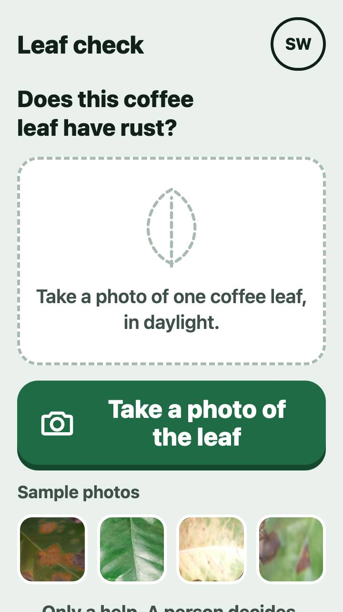
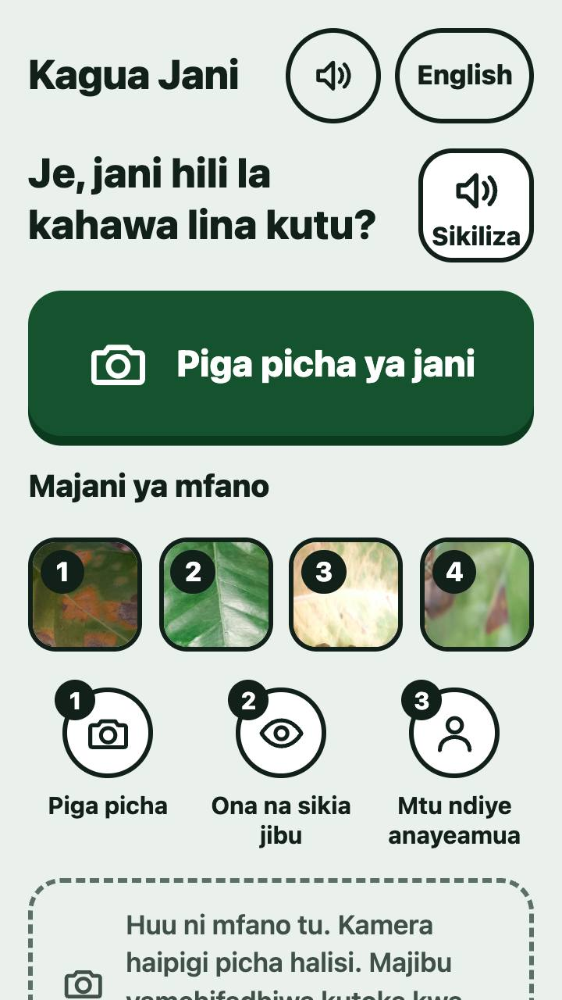
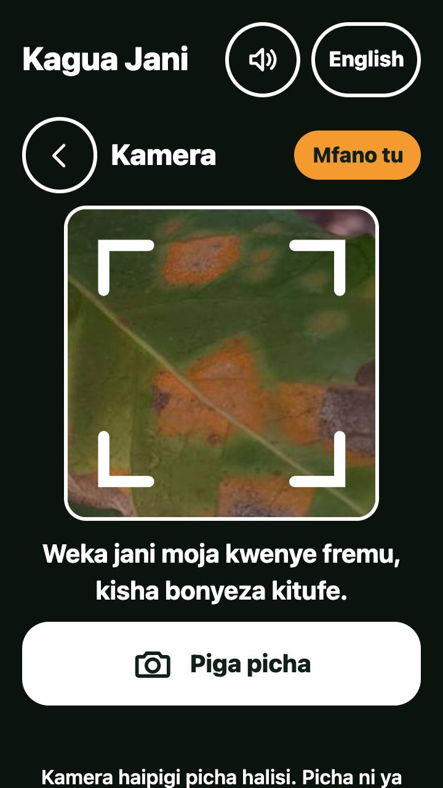
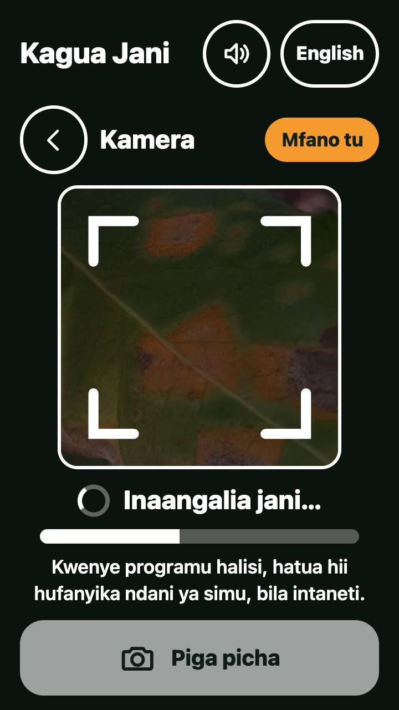
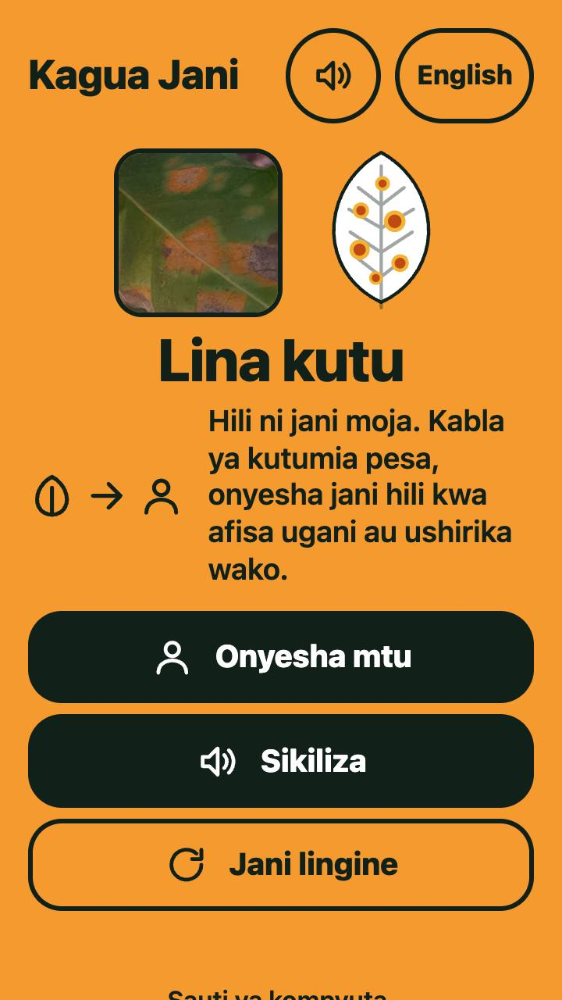
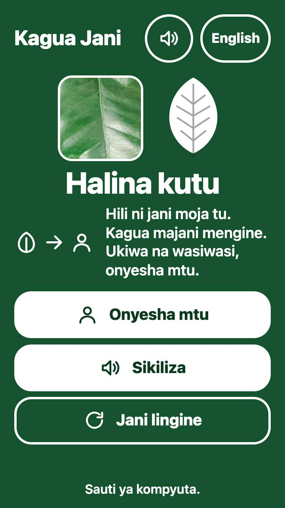
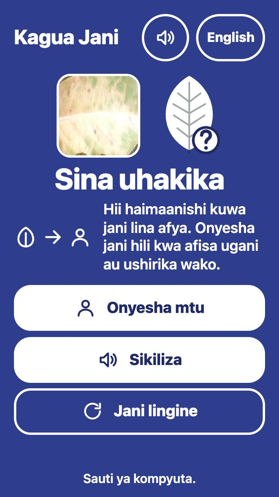
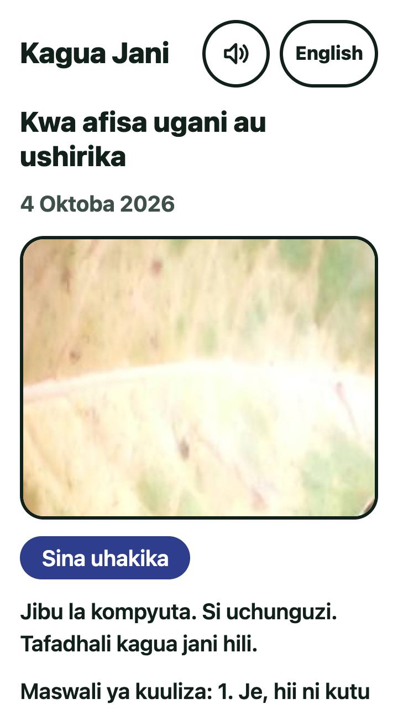
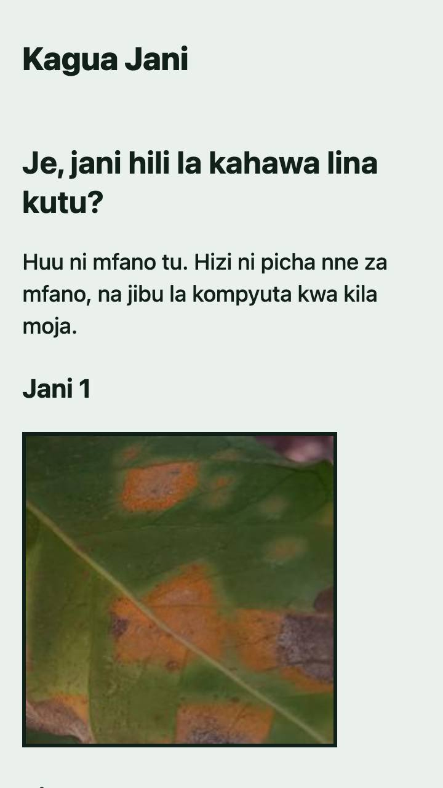

# Designing Kagua Jani for farmers who find devices hard

A desk study, and what we changed because of it. Written on 4 October 2026 for the ShhS team, Hack-Nation x World Bank "Small AI for Development", Challenge 04 (Agriculture).

## Summary

The brief gives us one user, Noor. She is 38 and farms 2 hectares of coffee. Her own phone is for calls, messages and mobile money. She uses her daughter's smartphone only when her daughter is home at the weekend, and then mostly to watch the news. There is no Wi-Fi at the house, and the household buys 3G data when it needs it. For most of the day she is out on the slope and the phone is at the house.

We asked one question: what would make a coffee leaf rust check usable by someone like her? We read six sets of sources, measured the page before and after, and rebuilt the page. This document records what we found, what we changed and what we have not tested.

What the sources agree on:

- Text fails for first-time, low-literacy users. Pictures with voice work, but even they need a helper at first.
- A younger relative usually sets up the phone, and the skills fade within weeks. So the helper is a user too.
- One leaf is a weak basis for a verdict, and people misdiagnose too. So the tool must never sound final.
- "Not sure" works when it is a normal answer with a clear next step, not an error.
- Many phones, browsers and data plans are small. So the page must be light, work offline and still read when scripts do not run.

What we changed:

- The page is now in Swahili, in text and voice, with a person always one tap away. The English switch is for reviewers.
- The answer is a full-screen colour, a drawn leaf, a few short words and a spoken line. The words say "this is one leaf" and never "healthy".
- A card lets the farmer show the answer to a helper, the cooperative or the extension officer. It carries two questions to ask.
- The page works offline after one visit, installs on the home screen and shows a plain version when scripts do not run.
- Every control is at least 48 CSS pixels, all text reaches AAA contrast, and the first visit moves 164 KB over the network.
- The camera is a simulation, so the page can show the real flow. Every simulated screen says "Example only".

What we have not done: we have not tested with farmers, a native Swahili speaker has not checked the words or the voice, and we have not tried the page on a low-end phone, Opera Mini, KaiOS or an iPhone. Section 8 lists these as next steps. Automated checks and a desk study cannot replace them.

## 1. How we did this

An AI assistant (Claude) ran the reading. It made six research passes in parallel: low-literacy interface research, accessibility standards, farmer evidence, voice and language, trust in AI answers, and offline and low-data web practice. Each pass was told to cite only pages it opened, to give the year of each source, to mark what it could not open, and to separate evidence from opinion.

Two PDFs were read page by page. Most web pages were read through a fetch tool that summarizes them, so a number can be wrong. Check any figure in the original source before you quote it. Section 10 lists every source and how far we trust it.

We also measured the page before and after the change, with a script anyone can run (`presentation/demo/tools/check.mjs`). Section 7 gives the results.

## 2. Who we design for

From the brief, Annex B and section 5:

- Noor, 38, farms 2 hectares in the Ondera highlands. Coffee grows on the upper slope, maize and beans below.
- She has belonged to the Ondera Coffee Cooperative for eleven years.
- She speaks her local language at home and the national language when she needs it.
- Two phones serve the household. Hers handles calls, messages and mobile money. Her 16-year-old daughter's smartphone is for the weekend, when the daughter sets it up and shows her how.
- There is no Wi-Fi. The household buys 3G data bundles. Most days she is on the slope and the phone is at the house.
- The extension officer visits the sub-county twice a year at best.

The brief's rules shape the design: the tool runs on a device she already has, its core feature works offline, a person makes the final call, and at least one interaction is in a named local language.

Four other people use the page, so we designed for them too:

- Her daughter, who sets up the phone and stays the helper.
- A cooperative clerk or lead farmer, who may operate the phone for her.
- The extension officer, who may read the answer on a card.
- Reviewers, who need the evidence and the limits.

What we assumed, and how sure we are:

| Assumption | Status |
| --- | --- |
| Noor reads little or no text on a phone | Our guess. The brief does not say. We design as if it is true, because it costs little. |
| She has a smartphone only at weekends, with help | From the brief |
| Her main language at home is not Swahili | Our guess. The brief names no language, and Ondera is made up. |
| She is online only when she has bought data | From the brief |
| Her phone's browser is Chrome | Likely, but unmeasured for her. Chrome is 65 to 87% of mobile browsing in Kenya, Tanzania and Uganda (StatCounter, September 2026). |

## 3. What stands in the way

| Barrier | What we know | What it means for the tool |
| --- | --- | --- |
| Reading | In a test in India, 0 of 20 first-time, low-literacy users finished a money transfer with text. 20 of 20 finished with hand-drawn pictures and spoken help, but slowly (Medhi and others, 2011). | Never rely on text alone. Show a picture, a colour, a few words and a voice together. |
| Fear of breaking the phone | Users in the same study feared a key press would break the phone. The authors call even the best design "not suitable for independent use by first-time users". | Say aloud that nothing here can break. Plan for a helper. |
| Skills fade | In a 2022 interview study, 23 of 30 low-literacy users relied on a helper to start and to keep going. One father said his daughter taught him, and it had slipped away since. | Treat the helper as a user. Put setup steps on the page. |
| Phone access | A 2026 conference abstract reports basic phones in 99% of surveyed households in Kenya and Uganda, and smartphones in 82% of Kenyan and 28% of Ugandan households. GSMA figures, as quoted by a trade site, say fewer women own smartphones. | Do not assume a smartphone in every home. A person with a smartphone may have to be the bridge. |
| Data cost | In 2019, 1 GB cost 7.1% of average monthly income in Africa (A4AI). Per-GB prices in 2023 were about $0.59 in Kenya, $0.84 in Tanzania and $1.11 in Uganda (Cable.co.uk, a price survey). | Keep the first load small and make everything work offline afterwards. |
| Old browsers | Opera Mini runs scripts on a server, has no service workers and lacks key and touch events. KaiOS 2.5 has no service workers either. Opera is 29.7% of mobile browsing in Kenya, but the figure does not split Opera Mini from Opera for Android. | Provide a plain-HTML version that needs no script. |
| Sunlight | One 2015 W3C note says glare makes contrast matter more. We found no outdoor ratio in any source. | Aim above the legal minimum. We chose 7:1 for text. |
| Language | Swahili is official in Kenya and Tanzania. In Uganda, Luganda is the most widely spoken language and Swahili is third (a tertiary source). The brief names no country. | State the language choice and make a new language cheap to add. |
| One leaf | In a cassava field test, single-leaf accuracy was 59% for mosaic disease and 21% for brown streak. Six leaves raised these to 93% and 73%. Trained extension workers scored 49% on single leaves, trained farmers 23% (Mrisho and others, 2020). | Say "one leaf" on every answer. Never sound final. |
| Over-trust | Automation bias is well documented, and design changes it (Goddard and others, 2012). A model can score 99.35% on photos like its training photos and about 31% on photos from other conditions (Mohanty and others, 2016). | Avoid a green all-clear. Keep a person in the loop. Be open about limits. |
| Extension access | The brief says the officer visits twice a year at best. | The next step cannot be "ask the officer" alone. Name the cooperative too. |
| Numbers | Low numeracy is common. Frequencies such as "9 in 10" are easier than percentages (Gigerenzer and others, 2007). No source tested percentages with low-literacy users. | Show no scores to farmers. Use frequencies for reviewers. |

## 4. What could help

The context also offers things to build on.

- Noor already watches news on YouTube, so she knows pictures and sound on a phone. She uses mobile money, so she knows numbered steps and confirmation screens.
- She has trusted the cooperative for eleven years. A cooperative clerk or lead farmer is a realistic helper. In a Kenyan chatbot trial, extension agents and lead farmers were users, and some farmers asked if family members could use it (developer report, low weight).
- Her daughter is already the setup helper. A "for the helper" section can make that easy.
- A tool that says "not sure, ask a person" has a precedent. Wadhwani AI's cotton tool sends doubtful photos to a larger model and then a human expert. In small experiments, users said they would wait up to 24 hours for an answer (developer paper, low weight).
- The set of answers is tiny, so a language is a file of about forty short strings plus a few recordings. We built the page that way.
- Meta's speech models have Swahili text-to-speech and strong recognition. They also list voices for Gikuyu, Ganda, Nyankore, Masaaba (Gisu), Soga, Ateso, Haya and Chagga varieties. Luganda has more validated Common Voice hours (437) than Swahili (392).
- The page is static, so after one visit it works offline and installs on the home screen.

## 5. What the research says

### 5.1 Text, pictures and voice

Medhi and others (ACM TOCHI, 2011) tested a money transfer with 58 first-time users in India. With text, 0 of 20 finished. With a voice menu, 13 of 18 finished. With hand-drawn pictures and spoken help, 20 of 20 finished, but they took 13 minutes against 5.2 for the voice group. Only the picture group saw an intro video, so the groups differ in more than the medium. We read this as "use both".

The same research warns that icons must be tested. In Medhi, Sagar and Toyama (2007), semi-abstract cartoons and realistic images beat complex abstract ones. A yellow road was rejected because roads are black. Chipchase (CGAP, 2010) says icons work like another alphabet, so each group must test them.

Voice has limits. In Gupta and others (2022), 28 of 30 users liked voice search, but it needs a connection and often mishears. In an eastern Uganda maize trial, a short video raised knowledge and use of recommended practices, and an IVR voice service and SMS reminders added little (Van Campenhout and others, 2021, abstract only). The video was shown in person, so a phone screen may not copy that.

Confidence: high that text fails for first-time low-literacy users, medium on the ranking of voice against pictures. The studies are old (2006 to 2011), mostly from India and run on feature phones. We found no study of machine voices, colour-coded answers or a "not sure" state.

### 5.2 Using a phone through a helper

Sambasivan and others (CHI, 2010) studied 22 women in two Bangalore slums for 110 hours. Helpers entered the request, read the answer aloud or did the whole task. 8 of the 22 women owned a phone, against 18 of their husbands. The authors want screens that both people can follow, with sound and pictures.

Gupta and others (2022) found that younger relatives set up the phone and the apps, and sometimes made the accounts. Skills faded. People feared breaking the phone.

What this means for us: no account, no password, a "for the helper" section, and one short written line on each answer in both Swahili and English so that a helper or an officer can follow the screen. One risk remains. A helper who presses the buttons might also make the call, which weakens "a person makes the final call". So the screens name the person to ask.

### 5.3 One leaf, and human error

In the PlantVillage Nuru field test (Mrisho and others, 2020), 60 people in Tanzania and Kenya judged 300 leaves on budget Android phones. Single-leaf accuracy was low for two cassava diseases and high for healthy leaves. Trained extension workers also scored low on single leaves. The authors call single-leaf diagnosis unreliable. The abstract we read gave other six-leaf figures, so check the paper before you quote it.

Uganda's plant clinics reviewed 351 records, and 217 were valid for both diagnosis and advice (Alokit and others, 2014). A written prescription went home with each farmer, who showed it at input shops. That is the model for our card.

CABI's coffee manual (Rutherford and Phiri, 2006) puts the spray trigger at 20% or more of leaves with pustules, a share one photo cannot show. It says rust matters little in cool highlands above 1700 metres. If Ondera is a cool highland, "no rust" will be the common answer, and a false "no rust" is the costly mistake.

### 5.4 Saying "not sure"

Google's People + AI Guidebook says to let the user take over when the system cannot answer, and to prefer buckets such as high, medium and low to raw numbers. Microsoft's guidelines (Amershi and others, CHI 2019) say to tell users what the system can do and how often it may be wrong. Both are practice guidance, not trial results.

Kim and others (FAccT, 2024) ran a pre-registered experiment with 404 people. First-person hedges such as "I'm not sure" lowered confidence in the system and agreement with wrong answers, so accuracy rose. The same hedges also lowered confidence overall. With three in ten photos answered "not sure", under-trust is a real risk. We found no field data on it.

In machine-learning terms, "not sure" is selective prediction: the tool answers fewer cases to be right more often on the ones it answers (Ruggieri and Pugnana, 2025). For us, the tool answers 72% of 300 held-out Uganda photos and is right on 96.5% of those. That figure blends the "rust" and "no rust" answers, so it hides how often each one is wrong. We have not yet split it.

### 5.5 Standards and trends

WCAG 2.2 (W3C Recommendation, 12 December 2024) holds the numbers we used: target size 24 CSS pixels at AA (2.5.8) and 44 at AAA (2.5.5), contrast 4.5:1 at AA (1.4.3) and 7:1 at AAA (1.4.6), reflow at 320 CSS pixels (1.4.10), text spacing (1.4.12), and a rule that audio playing by itself for more than 3 seconds needs a pause, stop or volume control (1.4.2). Apple asks for 44 points and Android for 48 dp, so we chose 48 CSS pixels, which meets all four.

The W3C's cognitive accessibility guidance (COGA, a Working Group Note from 2021) gives patterns, not pass or fail rules: familiar symbols, a short critical path, a way back and human help. WCAG 3.0 is still a draft, and its contrast method is undecided, so we did not use APCA values. The preference media queries for contrast, forced colours and reduced motion work in current browsers. `prefers-reduced-data` does not, so the page is small by default.

Trends that the sources support: rules are converging on WCAG 2.2 AA, cognitive needs are reaching Level A (consistent help, no repeated entry), and guidance asks for text, shape and sound together. We treat AI that rewrites an interface by itself as hype, and voice-first as unproven, because guidance adds voice to text and we found no usage data.

### 5.6 Offline, low data and old browsers

A service worker cannot help on the first visit, and a new version waits until old tabs close (web.dev). So someone must load the page once with data. Chrome installs a site with a manifest, icons at 192 and 512 pixels and HTTPS. Safari can delete a site's saved data, caches included, after seven days of Safari use without a visit (WebKit, 2020), so iPhone users should add the page to the home screen.

MP3 plays everywhere that plays audio. Opus is only partly supported on iPhones before iOS 18.4. We used MP3, mono, 16 kHz, 32 kbit/s, which makes each clip 3 to 36 KB.

For one budget reference, Alex Russell's 2026 analysis gives about 2 MiB for a three-second load on a mid-range phone with 9 Mbit/s. Our first visit is about 8% of that.

### 5.7 Voice and language

Meta's mms-tts-swh is a single voice under a non-commercial licence (CC-BY-NC 4.0). The 2023 paper rates its speech models by recognition error and does not give a Swahili voice score. Meta's Swahili recognition beats Whisper on read speech (FLEURS word error 15.6 to 29.6% against 39.3 to 52.8%).

We found no study of how farmers hear a machine voice. One 2003 lab study found a human voice beat a machine voice for learning. Two practical rules followed: say the answer first and alone, in a clip under three seconds, and put the longer next-step clip behind a tap. Label the audio as a machine voice while it is one.

Official Tanzanian Swahili uses "maafisa ugani" for extension officers and "kutu ya majani ya kahawa" for coffee leaf rust. That shows the terms exist. It does not show that our sentences sound natural.

### 5.8 What we could not find

- No study tested machine voices, colour-coded answers, percentages or a "not sure" state with low-literacy users.
- Almost no source covers East African coffee farmers. The NARO study on Ugandan farmers and coffee rust would not open.
- No source gives the cost or time to add a language.
- We found no source on how farmers react to a wrong photo diagnosis.
- Outdoor contrast evidence is thin. We chose 7:1 on judgement.

## 6. Design principles

We turned the findings into ten rules. Each has a test, because a rule that cannot fail is not a rule.

1. One job on each screen. Home: the question, one big button and four sample leaves. Camera: one leaf and one button. Answer: the answer and the next step. Card: what to show a person. Test: a first-time user finishes alone, and we count prompts.
2. Say it four ways: a word, a picture, a colour and a voice. Colour must never carry the meaning alone (WCAG 1.4.1). Test: show each answer without sound, then in greyscale, and ask what it means.
3. Voice starts short and alone, and the long clip waits for a tap. Every clip can be stopped (WCAG 1.4.2). Test: no clip that plays by itself lasts longer than 3 seconds.
4. Never give an all-clear. No green tick. Every answer says "one leaf". "Not sure" says it does not mean healthy. Test: after a "not sure" screen, fewer than 1 in 10 people say the leaf is healthy.
5. A person decides, and the first button after any answer leads to a person (COGA, WCAG 3.2.6 consistent help). Test: after an orange screen, fewer than 1 in 5 people say "spray now".
6. Design for the helper. No account. Setup steps. A line in English for the officer. Test: a 16-year-old sets it up unaided and we time it.
7. Work with what the phone has. Offline after one visit, light, and readable without scripts. Test: airplane mode and scripts off.
8. Readable in sun. Text at 7:1, a base size of 18 pixels in rem units, no text over photos, and a high-contrast style. Test: read it outdoors on a mid-range phone at full brightness.
9. Be literally true. Say what is saved and what is simulated. Say the voice is a machine and the Swahili is unchecked. Say the tool has not been tested with farmers. Test: ask 5 people "Can you check your own leaf here?" Any yes means the label failed.
10. Big, steady controls. At least 48 pixels, in the same place on every screen, with a visible focus ring, a working back button and a link to every answer. Test: the check script.

## 7. What we changed

Before is the page as it stood at about 15:00 on 4 October. After is the page in this repository.





| Part | Before | After | Why |
| --- | --- | --- | --- |
| Language | Spanish, Portuguese and English switch | Swahili in text and voice. A small switch labelled with the language's own name, for reviewers. | The brief wants a named local language (principle 2, section 5.7) |
| First screen | A camera button that failed when no model was connected | A big camera button, four sample leaves, three numbered steps and a spoken instruction | One job per screen (1). A failing main button is worse than none. |
| Camera | None | A simulated viewfinder, a shutter and a short "looking at the leaf" step. Every simulated screen says "Example only". | The team asked for a presentation of the real flow. The label keeps it true (9). |
| Answer screen | A number gauge and a green tick for "no rust" | A full-screen colour, a drawn leaf with spots, a person-with-question mark or a plain leaf, big words and a next step that says "one leaf" | Principles 2, 4, 5 |
| Colours | Orange, green and blue, white text, 5.0 to 7.9:1 | Amber with dark text, forest green and indigo with white text, 7.65 to 9.6:1 | Sunlight (8). Colour-blind distance (see "How we checked"). |
| Voice | One long clip that played by itself | A clip under one second plays when the answer opens. A longer clip waits for a tap. A visible stop button, a sound switch and a "machine voice" note. | Principle 3 |
| Person | A sentence | A card with the photo, answer, date, a line in both languages and two questions to ask | Principles 5 and 6 |
| Helper | None | A "for the helper" section with four steps and a short limits note in Swahili | Principle 6 |
| Words | Spread through the code | One file, `src/strings.json`, which also drives the voice and the plain page | A native speaker can review one file |
| Offline | None | Works offline after one visit, installs on the home screen, shows a plain-HTML copy when scripts do not run | Principle 7 |
| Controls | Back button left the site | Back goes answer, camera, list. Every answer has a link. The page title changes. Escape works. | Principle 10 |
| Privacy | None stated | A content security policy and a permissions policy that blocks camera, microphone and location. No outside request. | Principle 9 |

The answer screens, in order:













And the plain page that shows when scripts do not run:



We decided against these, and why:

- Percentages for farmers, because no source tested them with low-literacy users and low numeracy is common.
- A green tick for "no rust", because it reads as an all-clear.
- Karaoke-style word highlighting and extra sounds, because we found no evidence they help.
- A swipe carousel, because dragging needs an alternative (WCAG 2.5.7) and a grid needs none.
- Dark mode, because the main use is outdoors in daylight.
- A "this looks wrong" report button, because it needs a backend we do not have.
- A retake hint on "not sure", because the demo has no real camera to retake with. It belongs in the real app.

### How we checked

Numbers come from three places: `tools/check.mjs` run against the live page on 4 October 2026 (55 of 55 checks pass), Lighthouse 12.8.2 in mobile mode, and `tools/colour_check.py`. Before is the page as it stood at about 15:00.

| Measure | Before | After |
| --- | --- | --- |
| Lighthouse mobile: accessibility, best practices, SEO | 100, 96, 100. One console error: the page had no favicon. | 100, 100, 100. No failing audit. |
| Lowest text contrast on any screen | 4.49:1, the "saved answer" line on the orange screen. That is below the 4.5:1 limit. | 7.44:1 |
| Text on the answer screens (rust, no rust, not sure) | 5.00:1, 6.47:1, 7.86:1 | 7.65:1, 9.11:1, 9.60:1 |
| Border of the picture frame | 2.0:1, below the 3:1 limit for controls | The frame is gone. The dashed note border is 4.6:1 or more. |
| Smallest distance between two answer screens, as seen with protanopia (simulated, CIE76) | 27.8, rust against no rust | 56.1 |
| The same with deuteranopia | 44.0 | 61.4 |
| The same with tritanopia | 14.0 | 14.4, green against indigo. This is the one weak pair. The words, the drawing and the voice still differ. |
| Smallest control | not measured | 48 by 48 CSS pixels or more on every screen |
| Layout at 320 and 360 pixels wide | not measured | No sideways scroll and no clipped text on all six screens. Text spacing overrides and double-size text break nothing. |
| First visit, over the network | About 650 KB if the voice plays: page 26 KB, photos 28 KB and three WAV clips of about 200 KB. | 164 KB for everything, voice included (text compressed). The research budget was 160 KB, so we are 2.5% over. |
| Offline | No | After one visit, the home screen, camera, answer and all seven voice clips work with no connection |
| Scripts off | An almost empty page | A plain page with the four answers, the photos and links to the sound |
| Back button | Left the site | Answer, then camera, then the list. Every answer has its own link. |
| Sound that starts by itself | One clip of about 7 seconds | Nothing on load. A clip under 1 second after a tap. |
| Time from the shutter to the answer in the simulation | Not applicable | 1.6 seconds |

Two limits. These checks run in desktop Chrome with a phone-size screen, so they say nothing about a low-end phone, a real sun or a real screen reader. And a perfect Lighthouse score only means no automated rule failed. It does not mean a first-time user can use the page.

## 8. What we did not do, and what comes next

### 8.1 Not done

- No test with farmers or helpers. Nothing here shows that Noor can use the page.
- No native speaker has checked the Swahili. A machine made the voice, and we do not know how farmers hear it.
- No test on a low-end Android phone, Opera Mini, KaiOS or an iPhone. We tested in desktop Chrome with a phone-size screen.
- No test with a screen reader such as TalkBack. We checked names, focus order and live regions with code, not with a person.
- The icons are untested with the target group. Research says to test them.
- The camera is a simulation. The real model has not run on a phone with farmers.

### 8.2 A test plan with farmers

Test with 8 to 10 people like Noor, with a facilitator who speaks the language, in two sessions two weeks apart. The first checks if the page is understood. The second checks if the skills survived. The thresholds below are our proposals, not findings.

| Task | Pass mark |
| --- | --- |
| Open the page and play the spoken instruction | 9 of 10 do it unaided |
| Pick a leaf, press the shutter, say what the answer means | 9 of 10 right |
| After an orange screen, say what to do next | fewer than 2 of 10 say "spray now"; at least 8 of 10 name a person |
| After a blue screen, say if the leaf is healthy | fewer than 1 of 10 say yes |
| Show the card to a helper | the helper states the answer and next step within 30 seconds |
| A 16-year-old sets up the page and the home-screen icon | unaided, and we time it |
| Compare the machine voice with a human recording | compare comprehension and "would you act on it" |
| Repeat the first two tasks after two weeks | the same pass marks |

### 8.3 A review of the Swahili

Ask two reviewers from the target region. Ask questions, not "is it right?":

- Heard alone, what does each answer mean?
- Does first-person "Sina uhakika" suit a tool?
- Do "Kabla ya kutumia pesa, onyesha jani hili..." and the other lines sound polite and natural?
- Which words does your region use for extension officer and cooperative?
- Does "kutu" alone name the disease, or do farmers say "kutu ya majani"?
- Is "Mfano tu" clear as "example only"?

Have the second reviewer back-translate. Ask for edits, not scores, and pay and credit the reviewers (Nekoto and others, 2020, describe this approach).

### 8.4 For the real app

- Record the answers with a human voice. The list is short, so this is cheap.
- Strip EXIF location from any photo before it is saved or shared, and never request Android's media-location permission.
- Keep any saved record on the phone with a delete button, and warn that a shared phone shows it.
- Measure how often "no rust" and "rust" answers are each wrong, because 96.5% hides the split.
- Add one retake hint to "not sure", then the card. Allow one retake prompt, so people do not shop for another answer.
- Store and forward the card: save it now, send it to the cooperative when a signal appears.
- Add a second language pack. Luganda fits the Uganda test data and has more Common Voice hours than Swahili. Languages with no Meta voice, such as Embu, Gusii, Kipsigis, Nandi, Bukusu, Dholuo and Kamba, need a native recording.
- Check the real wording of "rust" in local advice. The one coffee manual we read is in English and from 2006.

## 9. Questions reviewers may ask

Why Swahili? The brief names no language and Ondera is made up. Swahili is official in Kenya and Tanzania, and our field photos come from Uganda and Kenya. In Uganda, Luganda is the most widely spoken language, so it is the natural second pack.

How would this fare in a less-supported language? The tool answers from three fixed labels, so the language layer only maps labels to strings and audio. A new language needs a bilingual translator who knows coffee for about forty strings, a native review, recordings by a native speaker and a short test with farmers. We found no source for the cost or time, so we will log the hours on the first pilot.

Why no percentages? Low numeracy is common, and no source tested percentages with low-literacy users. Reviewers get frequencies: about 7 in 10 answered, about 19 in 20 of those right.

Why no green tick? Because a false "no rust" brings false calm and delay. People also read colour literally.

Is the camera real? No. It is a simulation, labelled "Example only" on every screen where it appears. The photos and answers are saved from the real model. The page asks for no camera, microphone or location, and the check script confirms it never calls the phone's camera.

Does it work offline? After one visit with internet, yes. The first visit cannot work offline, so the helper must load the page once.

Has it been tested with farmers? No. Section 8 says what we would do.

## 10. Sources

How far we trust each source: high means a standard, a peer-reviewed paper or a platform document that we read. Medium means a summary we could not verify in full, or an old or distant study. Low means a developer report, a trade site or a tertiary source.

### Low-literacy and novice users

- Medhi Thies and others, "Designing Mobile Interfaces for Novice and Low-Literacy Users", ACM TOCHI, 2011. https://www.microsoft.com/en-us/research/wp-content/uploads/2016/02/ToCHI2711_Medhi.pdf . Trust: high that text fails, medium on the ranking.
- Medhi, Sagar and Toyama, "Text-Free User Interfaces for Illiterate and Semiliterate Users", Information Technologies and International Development, 2007. https://ocw.mit.edu/courses/mas-965-nextlab-i-designing-mobile-technologies-for-the-next-billion-users-fall-2008/8ccecb3eacd514b7ea0255f5158de907_MITMAS_965F08_medhi2007.pdf . Medium.
- Sambasivan, Cutrell, Toyama and Nardi, "Intermediated Technology Use in Developing Communities", CHI, 2010. https://www.microsoft.com/en-us/research/wp-content/uploads/2016/02/p2583-sambasivan-intermediated.pdf . High that it happens, medium for Kenya.
- Gupta, Mehta, Punj and Medhi Thies, "Sophistication with Limitation: Understanding Smartphone Usage by Emergent Users in India", ACM COMPASS, 2022. https://www.microsoft.com/en-us/research/wp-content/uploads/2022/05/compass22-34-taps.pdf . Medium.
- Chipchase, "For Mobile Banking, Lessons from Research into Illiteracy", CGAP, 2010. https://cgap.org/node/1793 . Practice, medium.
- Nielsen, "Lower-Literacy Users: Writing for a Broad Consumer Audience", Nielsen Norman Group, 2005. https://www.nngroup.com/articles/writing-for-lower-literacy-users/ . Medium; the readers could read.
- IDEO, "5 Tools to Design for Digital Confidence", 2020. https://www.ideo.com/blog/5-tools-to-design-for-digital-confidence . Practice, low.
- Cuendet, Medhi, Bali and Cutrell, "VideoKheti", CHI, 2013. https://www.microsoft.com/en-us/research/?p=164234 . Abstract only.

### Standards and platforms

- W3C, Web Content Accessibility Guidelines 2.2, 12 December 2024. https://www.w3.org/TR/WCAG22/ . High.
- W3C, Understanding SC 2.5.8 Target Size (Minimum). https://www.w3.org/WAI/WCAG22/Understanding/target-size-minimum.html . High.
- W3C, Making Content Usable for People with Cognitive and Learning Disabilities, Working Group Note, 2021. https://www.w3.org/TR/coga-usable/ . High on content, but a Note binds nobody.
- W3C, WCAG 3.0 Working Draft, 10 September 2026. https://www.w3.org/TR/wcag-3.0/ . High that it is a draft.
- W3C, Mobile Accessibility: How WCAG 2.0 Applies to Mobile, First Public Working Draft, 2015. https://www.w3.org/TR/mobile-accessibility-mapping/ . Medium-low, old.
- Apple, Human Interface Guidelines, Accessibility. https://developer.apple.com/tutorials/data/design/human-interface-guidelines/accessibility.json . High.
- Android Accessibility Help, Touch target size. https://support.google.com/accessibility/android/answer/7101858?hl=en . High.
- MDN, `prefers-contrast`, `forced-colors`, `prefers-reduced-data`, ARIA live regions and the History API. https://developer.mozilla.org/ . High.
- DWT, European Accessibility Act ICT standards update, 18 September 2026. https://www.dwt.com/insights/2026/09/european-accessibility-act-ict-standards-update . A law-firm article, medium.

### Farmers and digital advice

- Mrisho and others, "Accuracy of a Smartphone-Based Object Detection Model, PlantVillage Nuru, in Identifying the Foliar Symptoms of the Viral Diseases of Cassava", Frontiers in Plant Science, 2020. https://pmc.ncbi.nlm.nih.gov/articles/PMC7775399 . Medium; recheck the figures.
- Alokit and others, "Reaching out to farmers with plant health clinics in Uganda", Uganda Journal of Agricultural Sciences, 2014. https://www.plantwise.org/wp-content/uploads/sites/4/2019/03/Reaching-Out-To-Farmers-With-Plant-Health-Clinics-In-Uganda.pdf . Medium.
- Fabregas, Kremer and Schilbach, "Realizing the potential of digital development: The case of agricultural advice", Science, 2019. https://economics.mit.edu/sites/default/files/2022-09/agricultural-advice-science.pdf . Medium.
- Van Campenhout, Spielman and Lecoutere, American Journal of Agricultural Economics, 2021. https://nru.uncst.go.ug/handle/123456789/8911 . Abstract only.
- Rutherford and Phiri, "Pests and diseases of coffee in eastern Africa", CABI, 2006. https://farm-d.org/wp-content/uploads/2024/03/U3071CoffeeManual.pdf . High for the biology, low for today's advice.
- Singh and others, "Farmer.Chat", arXiv, 2024. https://arxiv.org/html/2409.08916v2 . A developer report, low.
- Agrawal, Papanai and White, "Maintaining User Trust Through Multistage Uncertainty Aware Inference", arXiv, 2024. https://arxiv.org/html/2402.00015 . A developer paper, low to medium.
- ILRI, news archive on a 2013 Kenyan radio and phone survey. https://newsarchive.ilri.org/archives/tag/radio . Low to medium.
- ConnectingAfrica, on the GSMA Mobile Gender Gap Report 2025. https://www.connectingafrica.com/digital-divide/sub-saharan-africa-narrows-mobile-gender-gap-for-second-year . Secondary, low.
- Michalscheck and others, conference abstract, 2026. https://ira.agroscope.ch/de-CH/publication/63244 . Households, not people. Low.
- Alliance for Affordable Internet, 2019. https://adi.a4ai.org/mobile-data-prices-fall-across-low-and-middle-income-countries/ . Low for today.

### Trust in AI answers

- Amershi and others, "Guidelines for Human-AI Interaction", CHI, 2019. https://www.microsoft.com/en-us/research/uploads/prod/2019/01/Guidelines-for-Human-AI-Interaction-camera-ready.pdf . High on content.
- Google PAIR, People + AI Guidebook. https://pair.withgoogle.com/chapter/errors-failing/ . Practice.
- Kim and others, "I'm Not Sure, But...", FAccT, 2024. https://arxiv.org/abs/2405.00623 . Medium.
- Zhang, Liao and Bellamy, "Effect of Confidence and Explanation on Accuracy and Trust Calibration", 2020. https://arxiv.org/abs/2001.02114 . Medium.
- Goddard, Roudsari and Wyatt, "Automation bias", JAMIA, 2012; Peters and others, 2006; Gigerenzer and others, 2007; van der Bles and others, 2019. Read as abstracts on Europe PMC. Medium.
- Ruggieri and Pugnana, "Things Machine Learning Models Know That They Don't Know", AAAI, 2025. https://ojs.aaai.org/index.php/AAAI/article/download/35094/37249 . High on definitions.
- Mohanty, Hughes and Salathe, "Using Deep Learning for Image-Based Plant Disease Detection", Frontiers in Plant Science, 2016. https://www.frontiersin.org/articles/10.3389/fpls.2016.01419/full . High that the effect exists.
- Dara, Hazrati Fard and Kaur, "Recommendations for ethical and responsible use of artificial intelligence in digital agriculture", 2022. https://www.frontiersin.org/journals/artificial-intelligence/articles/10.3389/frai.2022.884192/full . A policy review, medium.
- Android Developers, shared-storage media guide. https://developer.android.com/training/data-storage/shared/media . High.

### Voice and language

- Meta, mms-tts-swh model card. https://huggingface.co/facebook/mms-tts-swh . High on facts, low on quality.
- Pratap and others, "Scaling Speech Technology to 1,000+ Languages", 2023. https://arxiv.org/abs/2305.13516 . High.
- Meta, MMS language coverage table. https://dl.fbaipublicfiles.com/mms/misc/language_coverage_mms.html ; Mozilla Common Voice release 27.0 statistics. https://github.com/common-voice/cv-dataset . High on the lists.
- Sherwani and others, "Speech vs. touch-tone", ICTD, 2009. https://doi.org/10.1109/ictd.2009.5426682 . Abstract only, medium.
- Mayer, Sobko and Mautone, "Social cues in multimedia learning", Journal of Educational Psychology, 2003. https://doi.org/10.1037/0022-0663.95.2.419 . Old, low for our case.
- Nekoto and others, "Participatory Research for Low-resourced Machine Translation", EMNLP Findings, 2020. https://aclanthology.org/2020.findings-emnlp.195/ . High on what they did.
- Tanzanian Ministry of Agriculture speech, 2 May 2024, and Mwananchi, 3 June 2025, for the terms "maafisa ugani" and "kutu ya majani ya kahawa". Tanzania only.
- Wikipedia, "Languages of Uganda", "Languages of Kenya", "Languages of Tanzania". Tertiary, medium.

### Offline and low data

- StatCounter Global Stats, mobile browser share for Uganda, Kenya and Tanzania, September 2026. https://gs.statcounter.com/browser-market-share/mobile/kenya . Medium.
- Opera, "Opera Mini and JavaScript". https://help.opera.com/en/opera-mini-and-javascript/ ; caniuse data for service workers, MP3 and Opus. https://github.com/Fyrd/caniuse . High on support, none on user counts.
- web.dev, "The service worker lifecycle", 2016, and "Install criteria", 2024; WebKit, "Full Third-Party Cookie Blocking and More", 2020. High.
- Cable.co.uk, "Worldwide mobile data pricing", 2023. https://bestbroadbanddeals.co.uk/mobiles/worldwide-data-pricing/ . Low to medium.
- Russell, "The Performance Inequality Gap, 2026". https://infrequently.org/2025/11/performance-inequality-gap-2026/ . Practice, medium.
- GSMA newsroom releases on mobile in Africa, 2024 to 2026. https://www.gsma.com/newsroom/ . Medium; none gives today's smartphone share by country.

### Sources we tried and could not open

GSMA Mobile Gender Gap Report pages (blocked), the NARO study on farmer awareness of coffee leaf rust in Uganda (error), Chipchase 2005 (no open copy), the BBC Mobile Accessibility Guidelines (refused), EUR-Lex and ETSI pages for the European standard, the FTC post "Keep Your AI Claims in Check" (not found), Plantwise coffee rust posts, Wadhwani's own pages, and several full texts behind paywalls or captchas.

## Appendix: repeat the checks

```bash
cd presentation/demo/tools
npm install
python3 -m http.server 5294 --directory ../public &
node check.mjs http://localhost:5294/        # or the live address
node shots.mjs <before-url> <after-url> ../../../docs/accessibility-study
```

`colour_check.py` prints the colour numbers. `check.mjs` runs 55 checks in a real Chrome: load and weight, reflow at 320 and 360 pixels, target size, contrast, keyboard focus, the camera flow, the back button, language, reduced motion, forced colours, text spacing, double-size text, audio length, a no-script page and offline use. `python3 presentation/demo/tools/build.py` rebuilds the page from `src/strings.json`.
